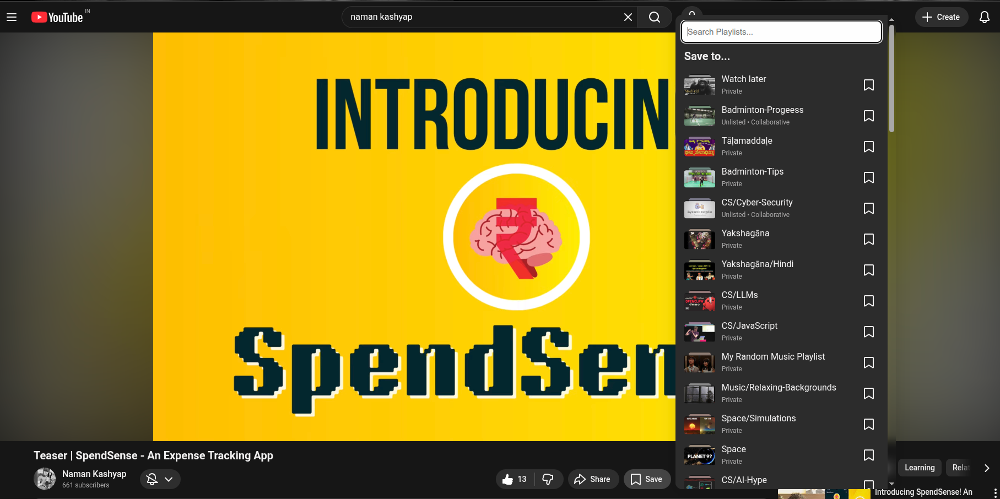
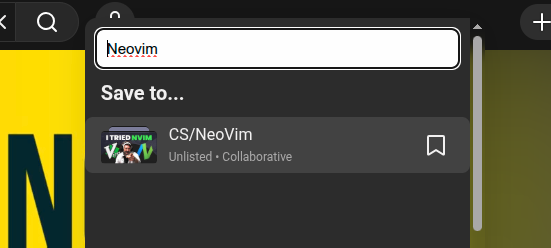

# YouTube Playlist Search

You organize your playlists.

You name them carefully.

You curate them thoughtfully.

And yet — when adding a video — YouTube makes you scroll through a long, recency-based list with no search.

This extension fixes that.

Adds a search bar.
Filters instantly.
Restores order to your workflow.

You're Welcome :)

## Screenshots

_You get a nice, simple search bar (in focus by default) at the top of the playlist container_

_Typing in the search bar will show results with the search key as a substring (case-insensitive)_
